# Hybrid Distributed Intelligence - Architecture Diagrams

## 1. Unified System Architecture (Complete Overview)

```mermaid
flowchart TB
    subgraph FACTORY["🏭 Mercedes-Benz Production Facility"]
        
        subgraph EDGE["Edge Intelligence Layer"]
            direction LR
            
            subgraph S1["Stamping Station"]
                S1_SENS[("📡 Sensors")]
                S1_PROC["⚡ Edge Processor"]
                S1_AI{{"🤖 AI Engine"}}
                S1_OUT(["📤 Output"])
                S1_SENS --> S1_PROC --> S1_AI --> S1_OUT
            end
            
            subgraph S2["Body Shop Station"]
                S2_SENS[("📡 Sensors")]
                S2_PROC["⚡ Edge Processor"]
                S2_AI{{"🤖 AI Engine"}}
                S2_OUT(["📤 Output"])
                S2_SENS --> S2_PROC --> S2_AI --> S2_OUT
            end
            
            subgraph S3["Paint Shop Station"]
                S3_SENS[("📡 Sensors")]
                S3_PROC["⚡ Edge Processor"]
                S3_AI{{"🤖 AI Engine"}}
                S3_OUT(["📤 Output"])
                S3_SENS --> S3_PROC --> S3_AI --> S3_OUT
            end
            
            subgraph S4["Assembly Station"]
                S4_SENS[("📡 Sensors")]
                S4_PROC["⚡ Edge Processor"]
                S4_AI{{"🤖 AI Engine"}}
                S4_OUT(["📤 Output"])
                S4_SENS --> S4_PROC --> S4_AI --> S4_OUT
            end
            
            subgraph S5["Quality Control Station"]
                S5_SENS[("📡 Sensors")]
                S5_PROC["⚡ Edge Processor"]
                S5_AI{{"🤖 AI Engine"}}
                S5_OUT(["📤 Output"])
                S5_SENS --> S5_PROC --> S5_AI --> S5_OUT
            end
        end
        
        subgraph NETWORK["🌐 Industrial Network Layer"]
            KAFKA[["Apache Kafka<br/>Message Broker"]]
            MQTT[["MQTT Broker"]]
            OPCUA[["OPC-UA Gateway"]]
        end
        
        subgraph CENTRAL["🧠 Central Intelligence Hub"]
            
            subgraph INGEST["Data Ingestion"]
                STREAM["Stream Processor"]
                VALIDATE["Validator"]
                TRANSFORM["Transformer"]
            end
            
            subgraph DATASTORE["Data Platform"]
                TSDB[("Time-Series DB")]
                LAKE[("Data Lake")]
                GRAPH[("Knowledge Graph")]
                CACHE[("Hot Cache")]
            end
            
            subgraph AICORE["AI/ML Core"]
                CORRELATE{{"Correlation Engine"}}
                PREDICT{{"Predictive Maintenance"}}
                OPTIMIZE{{"Process Optimization"}}
                ANOMALY{{"Anomaly Detection"}}
            end
            
            subgraph SERVICES["Application Services"]
                API["API Gateway"]
                NOTIFY["Notification Service"]
                REPORT["Reporting Engine"]
            end
            
            subgraph PRESENTATION["Presentation Layer"]
                EXEC_DASH["Executive Dashboard"]
                ENG_CONSOLE["Engineering Console"]
                MOBILE["Mobile App"]
            end
        end
    end
    
    S1_OUT --> KAFKA
    S2_OUT --> KAFKA
    S3_OUT --> KAFKA
    S4_OUT --> KAFKA
    S5_OUT --> KAFKA
    
    KAFKA <--> MQTT
    MQTT <--> OPCUA
    
    KAFKA --> STREAM
    STREAM --> VALIDATE --> TRANSFORM
    TRANSFORM --> TSDB
    TRANSFORM --> LAKE
    
    TSDB --> AICORE
    LAKE --> AICORE
    AICORE --> GRAPH
    
    CORRELATE --> API
    PREDICT --> API
    OPTIMIZE --> API
    ANOMALY --> NOTIFY
    
    API --> EXEC_DASH
    API --> ENG_CONSOLE
    NOTIFY --> MOBILE

    style EDGE fill:#1a1a2e,stroke:#4a90d9,stroke-width:3px,color:#fff
    style NETWORK fill:#2d2d44,stroke:#ffa726,stroke-width:3px,color:#fff
    style CENTRAL fill:#16213e,stroke:#e94560,stroke-width:3px,color:#fff
    style INGEST fill:#1a237e,stroke:#7986cb,stroke-width:2px
    style DATASTORE fill:#004d40,stroke:#4db6ac,stroke-width:2px
    style AICORE fill:#4a148c,stroke:#ba68c8,stroke-width:2px
    style SERVICES fill:#bf360c,stroke:#ff8a65,stroke-width:2px
    style PRESENTATION fill:#1b5e20,stroke:#a5d6a7,stroke-width:2px
```

---

## 2. Edge Station - Generic Internal Architecture

```mermaid
flowchart TB
    subgraph EDGE_MODULE["🔧 Edge AI Module - Internal Architecture"]
        
        subgraph SENSORS["Sensor Integration Layer"]
            CAM["📷 Industrial Camera<br/>4K @ 60fps"]
            THERMAL["🌡️ Thermal Sensor"]
            VIBRATION["📳 Vibration Sensor"]
            PRESSURE["⏲️ Pressure Sensor"]
            TORQUE["🔩 Torque Sensor"]
            PLC["🎛️ PLC Interface"]
        end
        
        subgraph ACQUISITION["Data Acquisition Module"]
            SYNC["⏱️ Time Sync<br/>NTP/PTP"]
            BUFFER["📥 Ring Buffer<br/>10s Window"]
            FILTER["🔧 Signal<br/>Filtering"]
            NORM["📊 Normalization"]
        end
        
        subgraph INFERENCE["AI Inference Engine"]
            PREPROCESS["Pre-processor"]
            
            subgraph MODELS["Model Ensemble"]
                CNN["🖼️ Vision CNN<br/>Defect Detection"]
                LSTM["📈 LSTM<br/>Time-Series"]
                RULES["📋 Rule Engine<br/>Thresholds"]
            end
            
            FUSION["🔀 Sensor Fusion<br/>Multi-Modal"]
            DECISION["⚡ Decision<br/>Engine"]
        end
        
        subgraph LOCALOUT["Local Output Module"]
            SCORE["📊 Quality Scorer"]
            CLASSIFY["🏷️ Defect Classifier"]
            ALERT["🚨 Alert Generator"]
            ACTUATOR["🎮 Actuator Control"]
        end
        
        subgraph STORAGE["Local Storage"]
            EVENTCACHE[("💾 Event Cache<br/>24h Rolling")]
            MODELREPO[("🗄️ Model Repository")]
            CONFIG[("⚙️ Configuration")]
        end
        
        subgraph COMMS["Communication Module"]
            UPSTREAM["📤 Upstream Publisher<br/>Kafka/MQTT"]
            DOWNSTREAM["📥 Downstream Listener<br/>Commands"]
            HEALTH["💓 Health Reporter"]
        end
    end
    
    CAM --> BUFFER
    THERMAL --> BUFFER
    VIBRATION --> BUFFER
    PRESSURE --> BUFFER
    TORQUE --> BUFFER
    PLC --> BUFFER
    
    SYNC --> BUFFER
    BUFFER --> FILTER --> NORM
    NORM --> PREPROCESS
    
    PREPROCESS --> CNN
    PREPROCESS --> LSTM
    PREPROCESS --> RULES
    
    CNN --> FUSION
    LSTM --> FUSION
    RULES --> FUSION
    
    FUSION --> DECISION
    MODELREPO -.-> MODELS
    
    DECISION --> SCORE
    DECISION --> CLASSIFY
    DECISION --> ALERT
    DECISION --> ACTUATOR
    
    SCORE --> EVENTCACHE
    CLASSIFY --> EVENTCACHE
    ALERT --> UPSTREAM
    SCORE --> UPSTREAM
    
    DOWNSTREAM --> CONFIG
    HEALTH --> UPSTREAM

    ALERT --> OPERATOR["👷 Operator HMI"]
    ACTUATOR --> MACHINE["⚙️ Machine Control"]
    UPSTREAM --> CENTRAL_HUB["☁️ Central Hub"]

    style SENSORS fill:#2a4a3a,stroke:#66bb6a,stroke-width:2px
    style ACQUISITION fill:#3d2a1a,stroke:#ff9800,stroke-width:2px
    style INFERENCE fill:#3a2a4a,stroke:#ab47bc,stroke-width:2px
    style LOCALOUT fill:#4a2a2a,stroke:#ef5350,stroke-width:2px
    style STORAGE fill:#4a3a2a,stroke:#ffa726,stroke-width:2px
    style COMMS fill:#2a3a4a,stroke:#42a5f5,stroke-width:2px
```

---

## 3. Stamping Station - Specific Architecture

```mermaid
flowchart LR
    subgraph STAMPING["⚙️ Stamping Station AI Module"]
        
        subgraph INPUTS["Input Sensors"]
            direction TB
            PRESS_FORCE["⏲️ Press Force<br/>Sensors"]
            STROKE_POS["📏 Stroke Position<br/>Encoders"]
            DIE_CAM["📷 Die Cavity<br/>Cameras"]
            BLANK_CAM["📷 Blank Feed<br/>Camera"]
            DIE_TEMP["🌡️ Die<br/>Temperature"]
            ACOUSTIC["🔊 Acoustic<br/>Emission"]
        end
        
        subgraph PROCESSING["AI Processing"]
            direction TB
            FORCE_ANAL["📊 Force Profile<br/>Analysis"]
            VISION_PROC["🖼️ Vision<br/>Processing"]
            SIGNAL_PROC["📈 Signal<br/>Analysis"]
        end
        
        subgraph DETECTIONS["Detection Capabilities"]
            direction TB
            CRACK["🔍 Crack Detection"]
            WRINKLE["🔍 Wrinkle Analysis"]
            THINNING["🔍 Thinning Detection"]
            SPRINGBACK["🔍 Springback Prediction"]
            MISALIGN["🔍 Blank Misalignment"]
            DIE_WEAR["🔍 Die Wear Tracking"]
        end
        
        subgraph OUTPUTS["Outputs"]
            direction TB
            PART_SCORE["✅ Part Quality Score"]
            TOOL_ALERT["⚠️ Tooling Alerts"]
            PARAM_REC["📋 Parameter<br/>Recommendations"]
            REJECT_SIG["❌ Reject Signal"]
        end
    end
    
    PRESS_FORCE --> FORCE_ANAL
    STROKE_POS --> FORCE_ANAL
    DIE_CAM --> VISION_PROC
    BLANK_CAM --> VISION_PROC
    DIE_TEMP --> SIGNAL_PROC
    ACOUSTIC --> SIGNAL_PROC
    
    FORCE_ANAL --> CRACK
    FORCE_ANAL --> THINNING
    VISION_PROC --> WRINKLE
    VISION_PROC --> MISALIGN
    SIGNAL_PROC --> SPRINGBACK
    SIGNAL_PROC --> DIE_WEAR
    
    CRACK --> PART_SCORE
    WRINKLE --> PART_SCORE
    THINNING --> PART_SCORE
    SPRINGBACK --> PARAM_REC
    MISALIGN --> REJECT_SIG
    DIE_WEAR --> TOOL_ALERT

    style STAMPING fill:#1e3a5f,stroke:#64b5f6,stroke-width:3px
    style INPUTS fill:#1a3a2e,stroke:#4caf50,stroke-width:2px
    style PROCESSING fill:#3a2a4a,stroke:#9c27b0,stroke-width:2px
    style DETECTIONS fill:#4a3a1a,stroke:#ff9800,stroke-width:2px
    style OUTPUTS fill:#3a1a1a,stroke:#f44336,stroke-width:2px
```

---

## 4. Body Shop Station - Specific Architecture

```mermaid
flowchart LR
    subgraph BODYSHOP["🔩 Body Shop AI Module"]
        
        subgraph INPUTS["Input Sensors"]
            direction TB
            WELD_CAM["📷 Weld Pool<br/>Cameras"]
            WELD_CURR["⚡ Welding<br/>Current"]
            ROBOT_POS["🤖 Robot<br/>Position"]
            LASER["📐 3D Laser<br/>Scanner"]
            THERM_IMG["🌡️ Thermal<br/>Imaging"]
            CLAMP["🔧 Clamping<br/>Force"]
        end
        
        subgraph PROCESSING["AI Processing"]
            direction TB
            WELD_ANAL["🔥 Weld Analysis"]
            GEOM_PROC["📐 Geometry<br/>Processing"]
            THERM_PROC["🌡️ Thermal<br/>Analysis"]
        end
        
        subgraph DETECTIONS["Detection Capabilities"]
            direction TB
            WELD_Q["🔍 Weld Quality"]
            SPATTER["🔍 Spatter Detection"]
            PENETRATION["🔍 Penetration Depth"]
            GAP["🔍 Gap Measurement"]
            DISTORT["🔍 Distortion Analysis"]
            ELECTRODE["🔍 Electrode Wear"]
        end
        
        subgraph OUTPUTS["Outputs"]
            direction TB
            JOINT_SCORE["✅ Joint Integrity Score"]
            ROBOT_ADJ["🤖 Robot Path Correction"]
            MAINT_FLAG["🔧 Maintenance Flags"]
            STOP_SIG["🛑 Emergency Stop"]
        end
    end
    
    WELD_CAM --> WELD_ANAL
    WELD_CURR --> WELD_ANAL
    ROBOT_POS --> GEOM_PROC
    LASER --> GEOM_PROC
    THERM_IMG --> THERM_PROC
    CLAMP --> GEOM_PROC
    
    WELD_ANAL --> WELD_Q
    WELD_ANAL --> SPATTER
    WELD_ANAL --> PENETRATION
    GEOM_PROC --> GAP
    GEOM_PROC --> DISTORT
    THERM_PROC --> ELECTRODE
    
    WELD_Q --> JOINT_SCORE
    GAP --> ROBOT_ADJ
    DISTORT --> ROBOT_ADJ
    ELECTRODE --> MAINT_FLAG
    SPATTER --> STOP_SIG

    style BODYSHOP fill:#3e2723,stroke:#8d6e63,stroke-width:3px
    style INPUTS fill:#1a3a2e,stroke:#4caf50,stroke-width:2px
    style PROCESSING fill:#3a2a4a,stroke:#9c27b0,stroke-width:2px
    style DETECTIONS fill:#4a3a1a,stroke:#ff9800,stroke-width:2px
    style OUTPUTS fill:#3a1a1a,stroke:#f44336,stroke-width:2px
```

---

## 5. Paint Shop Station - Specific Architecture

```mermaid
flowchart LR
    subgraph PAINTSHOP["🎨 Paint Shop AI Module"]
        
        subgraph INPUTS["Input Sensors"]
            direction TB
            SPRAY_CAM["📷 Spray Pattern<br/>Camera"]
            THICKNESS["📏 Film Thickness<br/>Sensor"]
            COLORIMETER["🎨 Colorimeter"]
            BOOTH_ENV["🌡️ Booth Environment<br/>Temp/Humidity/Flow"]
            ROBOT_TEL["🤖 Robot<br/>Telemetry"]
            SURFACE["📷 Surface<br/>Camera"]
        end
        
        subgraph PROCESSING["AI Processing"]
            direction TB
            SPRAY_ANAL["💨 Spray Analysis"]
            COLOR_PROC["🎨 Color<br/>Processing"]
            ENV_PROC["🌡️ Environment<br/>Monitoring"]
        end
        
        subgraph DETECTIONS["Detection Capabilities"]
            direction TB
            ORANGE_PEEL["🔍 Orange Peel"]
            RUNS_SAGS["🔍 Runs & Sags"]
            DUST["🔍 Dust Inclusions"]
            COLOR_MATCH["🔍 Color Matching"]
            COVERAGE["🔍 Coverage Analysis"]
            EDGE_QUAL["🔍 Edge Quality"]
        end
        
        subgraph OUTPUTS["Outputs"]
            direction TB
            FINISH_SCORE["✅ Finish Quality Score"]
            SPRAY_OPT["💨 Spray Parameters"]
            BOOTH_ADJ["🌡️ Environment Adjust"]
            REWORK_FLAG["🔧 Rework Required"]
        end
    end
    
    SPRAY_CAM --> SPRAY_ANAL
    THICKNESS --> SPRAY_ANAL
    COLORIMETER --> COLOR_PROC
    BOOTH_ENV --> ENV_PROC
    ROBOT_TEL --> SPRAY_ANAL
    SURFACE --> COLOR_PROC
    
    SPRAY_ANAL --> ORANGE_PEEL
    SPRAY_ANAL --> RUNS_SAGS
    SPRAY_ANAL --> COVERAGE
    COLOR_PROC --> COLOR_MATCH
    COLOR_PROC --> DUST
    ENV_PROC --> EDGE_QUAL
    
    ORANGE_PEEL --> FINISH_SCORE
    COLOR_MATCH --> FINISH_SCORE
    RUNS_SAGS --> SPRAY_OPT
    COVERAGE --> SPRAY_OPT
    DUST --> BOOTH_ADJ
    EDGE_QUAL --> REWORK_FLAG

    style PAINTSHOP fill:#4a148c,stroke:#ce93d8,stroke-width:3px
    style INPUTS fill:#1a3a2e,stroke:#4caf50,stroke-width:2px
    style PROCESSING fill:#3a2a4a,stroke:#9c27b0,stroke-width:2px
    style DETECTIONS fill:#4a3a1a,stroke:#ff9800,stroke-width:2px
    style OUTPUTS fill:#3a1a1a,stroke:#f44336,stroke-width:2px
```

---

## 6. Assembly Station - Specific Architecture

---

## 7. Quality Control Station - Specific Architecture

```mermaid
flowchart LR
    subgraph QC["✅ Quality Control AI Module"]
        
        subgraph INPUTS["Input Sensors"]
            direction TB
            MULTI_CAM["📷 Multi-Angle<br/>Cameras"]
            CMM["📐 CMM<br/>Measurements"]
            FUNC_TEST["🔧 Functional<br/>Test Data"]
            LEAK_TEST["💧 Leak Test<br/>Results"]
            ELEC_TEST["⚡ Electrical<br/>Tests"]
            ROAD_SIM["🚗 Road<br/>Simulation"]
        end
        
        subgraph PROCESSING["AI Processing"]
            direction TB
            DIM_PROC["📐 Dimensional<br/>Analysis"]
            VISUAL_PROC["🖼️ Visual<br/>Inspection"]
            FUNC_PROC["🔧 Functional<br/>Validation"]
        end
        
        subgraph DETECTIONS["Detection Capabilities"]
            direction TB
            DIM_VER["✔️ Dimensional Verify"]
            COSMETIC["✔️ Cosmetic Inspect"]
            FUNC_VAL["✔️ Functional Valid"]
            TRACE["🔗 Full Traceability"]
            PRED_Q["📈 Predictive Quality"]
            ROOT["🔍 Root Cause Suggest"]
        end
        
        subgraph OUTPUTS["Outputs"]
            direction TB
            CERT_SCORE["🏆 Certification Score"]
            REWORK_REC["🔧 Rework Recommendations"]
            UPSTREAM_FB["📤 Upstream Feedback"]
            RELEASE["✅ Release Decision"]
        end
    end
    
    MULTI_CAM --> VISUAL_PROC
    CMM --> DIM_PROC
    FUNC_TEST --> FUNC_PROC
    LEAK_TEST --> FUNC_PROC
    ELEC_TEST --> FUNC_PROC
    ROAD_SIM --> FUNC_PROC
    
    DIM_PROC --> DIM_VER
    VISUAL_PROC --> COSMETIC
    FUNC_PROC --> FUNC_VAL
    DIM_VER --> TRACE
    COSMETIC --> PRED_Q
    FUNC_VAL --> ROOT
    
    DIM_VER --> CERT_SCORE
    COSMETIC --> CERT_SCORE
    FUNC_VAL --> CERT_SCORE
    PRED_Q --> UPSTREAM_FB
    ROOT --> REWORK_REC
    CERT_SCORE --> RELEASE

    style QC fill:#b71c1c,stroke:#ef9a9a,stroke-width:3px
    style INPUTS fill:#1a3a2e,stroke:#4caf50,stroke-width:2px
    style PROCESSING fill:#3a2a4a,stroke:#9c27b0,stroke-width:2px
    style DETECTIONS fill:#4a3a1a,stroke:#ff9800,stroke-width:2px
    style OUTPUTS fill:#3a1a1a,stroke:#f44336,stroke-width:2px
```

---

## 8. Central Hub - Complete Internal Architecture

---

## 9. Correlation Engine - Deep Dive

```mermaid
flowchart TB
    subgraph CORR_ENGINE["🔗 Cross-Stage Correlation Engine"]
        
        subgraph INPUTS["Input Event Streams"]
            EVT_STAMP["📦 Stamping Events"]
            EVT_BODY["📦 Body Shop Events"]
            EVT_PAINT["📦 Paint Events"]
            EVT_ASSY["📦 Assembly Events"]
            EVT_QC["📦 QC Events"]
        end
        
        subgraph TRACKING["Vehicle Tracking Module"]
            VIN_REG[("VIN Registry")]
            STAGE_LOG[("Stage Timestamps")]
            GENEALOGY[("Component Genealogy")]
        end
        
        subgraph ANALYSIS["Correlation Analysis"]
            TIME_CORR["⏱️ Temporal Correlation<br/>Granger Causality"]
            SPATIAL["📍 Spatial Correlation<br/>Defect Location Map"]
            CAUSAL_INF["🔬 Causal Inference<br/>DoWhy/CausalNex"]
            CROSS_REF["🔗 Cross-Reference<br/>Defect Propagation"]
        end
        
        subgraph DISCOVERY["Pattern Discovery"]
            ASSOC["📊 Association Rules<br/>FP-Growth"]
            SEQ_MINE["📈 Sequential Patterns<br/>GSP Algorithm"]
            CLUSTER["🎯 Clustering<br/>HDBSCAN"]
        end
        
        subgraph OUTPUTS["Outputs"]
            ROOT_CAUSE["🎯 Root Cause<br/>Hypothesis"]
            IMPACT_MAP["🗺️ Impact<br/>Propagation Map"]
            RULES_DB[("Correlation<br/>Rules DB")]
            ALERTS["⚠️ Cross-Stage<br/>Alerts"]
        end
    end
    
    EVT_STAMP --> VIN_REG
    EVT_BODY --> VIN_REG
    EVT_PAINT --> VIN_REG
    EVT_ASSY --> VIN_REG
    EVT_QC --> VIN_REG
    
    VIN_REG --> STAGE_LOG
    STAGE_LOG --> GENEALOGY
    
    GENEALOGY --> TIME_CORR
    GENEALOGY --> SPATIAL
    GENEALOGY --> CAUSAL_INF
    GENEALOGY --> CROSS_REF
    
    TIME_CORR --> ASSOC
    SPATIAL --> CLUSTER
    CAUSAL_INF --> SEQ_MINE
    CROSS_REF --> SEQ_MINE
    
    ASSOC --> ROOT_CAUSE
    CLUSTER --> IMPACT_MAP
    SEQ_MINE --> RULES_DB
    ROOT_CAUSE --> ALERTS

    style CORR_ENGINE fill:#263238,stroke:#78909c,stroke-width:3px
    style INPUTS fill:#1a3a2e,stroke:#66bb6a,stroke-width:2px
    style TRACKING fill:#2a3a4a,stroke:#42a5f5,stroke-width:2px
    style ANALYSIS fill:#3a2a4a,stroke:#ab47bc,stroke-width:2px
    style DISCOVERY fill:#4a3a1a,stroke:#ffa726,stroke-width:2px
    style OUTPUTS fill:#3a1a1a,stroke:#ef5350,stroke-width:2px
```

---

## 10. Predictive Maintenance Engine - Deep Dive

```mermaid
flowchart TB
    subgraph PRED_MAINT["🔮 Predictive Maintenance Engine"]
        
        subgraph DATA["Data Sources"]
            EQUIP_TEL["📡 Equipment Telemetry"]
            MAINT_HIST[("📋 Maintenance History")]
            FAIL_LOG[("❌ Failure Logs")]
            ENV_DATA["🌡️ Environmental Data"]
            USAGE["📊 Usage Patterns"]
        end
        
        subgraph FEATURE["Feature Engineering"]
            ROLLING["📈 Rolling Statistics<br/>Mean/Std/Trend"]
            FFT["🌊 Frequency Domain<br/>FFT Analysis"]
            DEGRAD["📉 Degradation<br/>Indicators"]
            HEALTH_IDX["💚 Health Index<br/>Computation"]
        end
        
        subgraph MODELS["Predictive Models"]
            
            subgraph SURVIVAL["Survival Analysis"]
                WEIBULL["📊 Weibull Distribution"]
                COX["📊 Cox Proportional Hazards"]
            end
            
            subgraph ML["Machine Learning"]
                LSTM_RUL["🧠 LSTM Networks"]
                XGB["🌲 XGBoost"]
                ENSEMBLE["🎯 Model Ensemble"]
            end
            
            subgraph ESTIMATE["RUL Estimation"]
                CONF["📊 Confidence Intervals"]
                PROB_CURVE["📈 Probability Curves"]
            end
        end
        
        subgraph ACTIONS["Actionable Outputs"]
            SCHED_MAINT["📅 Scheduled Maintenance"]
            SPARE_PARTS["📦 Spare Parts Demand"]
            PRIORITY["🎯 Priority Queue"]
            COST_OPT["💰 Cost Optimization"]
        end
    end
    
    EQUIP_TEL --> ROLLING
    MAINT_HIST --> DEGRAD
    FAIL_LOG --> DEGRAD
    ENV_DATA --> ROLLING
    USAGE --> FFT
    
    ROLLING --> HEALTH_IDX
    FFT --> HEALTH_IDX
    DEGRAD --> HEALTH_IDX
    
    HEALTH_IDX --> WEIBULL
    HEALTH_IDX --> COX
    HEALTH_IDX --> LSTM_RUL
    HEALTH_IDX --> XGB
    
    WEIBULL --> ENSEMBLE
    COX --> ENSEMBLE
    LSTM_RUL --> ENSEMBLE
    XGB --> ENSEMBLE
    
    ENSEMBLE --> CONF
    ENSEMBLE --> PROB_CURVE
    
    CONF --> SCHED_MAINT
    PROB_CURVE --> SPARE_PARTS
    SCHED_MAINT --> PRIORITY
    PRIORITY --> COST_OPT

    style PRED_MAINT fill:#311b92,stroke:#b39ddb,stroke-width:3px
    style DATA fill:#1a3a2e,stroke:#66bb6a,stroke-width:2px
    style FEATURE fill:#3d2a1a,stroke:#ff9800,stroke-width:2px
    style MODELS fill:#3a2a4a,stroke:#ab47bc,stroke-width:2px
    style ACTIONS fill:#1a3a4a,stroke:#29b6f6,stroke-width:2px
```

---

## 11. Process Optimization Engine - Deep Dive

```mermaid
flowchart TB
    subgraph PROCESS_OPT["⚡ Process Optimization Engine"]
        
        subgraph INPUTS["Optimization Inputs"]
            PARAMS["⚙️ Current Parameters"]
            QUALITY["📊 Quality Outcomes"]
            CYCLE["⏱️ Cycle Time Data"]
            ENERGY["⚡ Energy Consumption"]
            CONSTRAINTS["📋 Business Constraints"]
        end
        
        subgraph MODELING["Process Modeling"]
            PHYSICS["🔬 Physics-Based<br/>Digital Twin"]
            DATA_MODEL["📊 Data-Driven<br/>Surrogate Models"]
            HYBRID["🔀 Hybrid<br/>Physics-ML"]
        end
        
        subgraph ALGORITHMS["Optimization Algorithms"]
            BAYES["🎲 Bayesian<br/>Optimization"]
            GENETIC["🧬 Genetic<br/>Algorithms (NSGA-II)"]
            RL["🤖 Reinforcement<br/>Learning (PPO)"]
            PARETO["📊 Multi-Objective<br/>Pareto Analysis"]
        end
        
        subgraph SIMULATION["Simulation & Validation"]
            WHAT_IF["❓ What-If Analysis"]
            AB_TEST["🔬 A/B Test Design"]
            ROLLOUT["📈 Gradual Rollout"]
        end
        
        subgraph OUTPUTS["Optimization Outputs"]
            PARAM_REC["⚙️ Parameter<br/>Recommendations"]
            TRADE_VIZ["📊 Trade-off<br/>Visualizations"]
            ROI_CALC["💰 ROI<br/>Calculations"]
            IMPL_PLAN["📋 Implementation<br/>Plan"]
        end
    end
    
    PARAMS --> PHYSICS
    QUALITY --> DATA_MODEL
    CYCLE --> DATA_MODEL
    ENERGY --> HYBRID
    CONSTRAINTS --> PARETO
    
    PHYSICS --> HYBRID
    DATA_MODEL --> HYBRID
    
    HYBRID --> BAYES
    HYBRID --> GENETIC
    HYBRID --> RL
    BAYES --> PARETO
    GENETIC --> PARETO
    RL --> PARETO
    
    PARETO --> WHAT_IF
    WHAT_IF --> AB_TEST
    AB_TEST --> ROLLOUT
    
    PARETO --> TRADE_VIZ
    ROLLOUT --> PARAM_REC
    TRADE_VIZ --> ROI_CALC
    ROI_CALC --> IMPL_PLAN

    style PROCESS_OPT fill:#1a237e,stroke:#9fa8da,stroke-width:3px
    style INPUTS fill:#1a3a2e,stroke:#66bb6a,stroke-width:2px
    style MODELING fill:#3a2a1a,stroke:#ffb74d,stroke-width:2px
    style ALGORITHMS fill:#3a2a4a,stroke:#ab47bc,stroke-width:2px
    style SIMULATION fill:#2a4a4a,stroke:#4dd0e1,stroke-width:2px
    style OUTPUTS fill:#4a2a2a,stroke:#ef5350,stroke-width:2px
```

---

## 12. End-to-End Data Flow

---

## 13. Deployment Architecture

```mermaid
flowchart TB
    subgraph DEPLOY["🏗️ Deployment Topology"]
        
        subgraph FLOOR["🏭 Factory Floor"]
            subgraph EDGE_HW["Edge Hardware"]
                E1["🖥️ Edge Server 1<br/>NVIDIA Jetson AGX"]
                E2["🖥️ Edge Server 2<br/>NVIDIA Jetson AGX"]
                E3["🖥️ Edge Server 3<br/>NVIDIA Jetson AGX"]
                E4["🖥️ Edge Server 4<br/>NVIDIA Jetson AGX"]
                E5["🖥️ Edge Server 5<br/>NVIDIA Jetson AGX"]
            end
            
            SWITCH["🔀 Industrial Switch<br/>Gigabit Ethernet"]
        end
        
        subgraph DC["🏢 On-Premise Data Center"]
            
            subgraph K8S["☸️ Kubernetes Cluster"]
                MASTER["🎛️ Control Plane<br/>3 Masters HA"]
                
                subgraph WORKERS["Worker Nodes"]
                    W_ING["📥 Ingestion<br/>8 vCPU, 32GB"]
                    W_GPU["🧠 AI/ML<br/>A100 GPU x2"]
                    W_SVC["🔌 Services<br/>16 vCPU, 64GB"]
                end
            end
            
            subgraph STORAGE["💾 Storage"]
                SAN["📀 SAN<br/>100TB NVMe"]
                NAS["📁 Backup NAS<br/>200TB"]
            end
            
            subgraph NET["🌐 Network"]
                FW["🔒 Firewall"]
                LB["⚖️ Load Balancer"]
            end
        end
        
        subgraph CLOUD["☁️ Cloud Extension"]
            ARCHIVE["🗄️ Cold Archive<br/>AWS S3 Glacier"]
            DR["🔄 Disaster Recovery<br/>Azure"]
            TRAIN["🎓 Model Training<br/>GCP Vertex AI"]
        end
    end
    
    E1 --> SWITCH
    E2 --> SWITCH
    E3 --> SWITCH
    E4 --> SWITCH
    E5 --> SWITCH
    
    SWITCH --> FW
    FW --> LB
    LB --> MASTER
    MASTER --> WORKERS
    WORKERS --> STORAGE
    
    SAN -.-> ARCHIVE
    W_GPU -.-> TRAIN
    K8S -.-> DR

    style FLOOR fill:#37474f,stroke:#90a4ae,stroke-width:3px
    style DC fill:#1a237e,stroke:#7986cb,stroke-width:3px
    style CLOUD fill:#004d40,stroke:#80cbc4,stroke-width:3px
    style K8S fill:#326ce5,stroke:#fff,stroke-width:2px
```

---

## 14. Security Architecture

```mermaid
flowchart TB
    subgraph SECURITY["🔒 Security Architecture"]
        
        subgraph PERIMETER["🛡️ Perimeter Security"]
            IND_FW["🔥 Industrial Firewall<br/>Zone Separation"]
            IDS["👁️ Intrusion Detection<br/>Suricata"]
            DMZ["🌐 DMZ Zone<br/>External Access"]
        end
        
        subgraph NET_SEC["🌐 Network Security"]
            VLAN["📡 VLAN Segmentation"]
            TLS["🔐 TLS 1.3<br/>Everywhere"]
            MTLS["🤝 mTLS<br/>Service Mesh"]
            VPN["🔒 VPN<br/>Remote Access"]
        end
        
        subgraph IDENTITY["👤 Identity & Access"]
            IAM["🎫 IAM System<br/>Keycloak"]
            MFA["📱 Multi-Factor Auth"]
            RBAC["👥 Role-Based Access"]
            AUDIT["📋 Audit Logging"]
        end
        
        subgraph DATA_SEC["💾 Data Security"]
            ENCRYPT["🔐 Encryption at Rest<br/>AES-256"]
            MASK["🎭 Data Masking"]
            DLP["🚫 Data Loss Prevention"]
            BACKUP["💾 Encrypted Backups"]
        end
        
        subgraph EDGE_SEC["🔧 Edge Security"]
            BOOT["🔐 Secure Boot"]
            HSM["🔑 Hardware Security<br/>Module"]
            ATTEST["✅ Device Attestation"]
            OTA["📥 Secure OTA Updates"]
        end
    end
    
    PERIMETER --> NET_SEC
    NET_SEC --> IDENTITY
    IDENTITY --> DATA_SEC
    IDENTITY --> EDGE_SEC

    style SECURITY fill:#b71c1c,stroke:#ef9a9a,stroke-width:3px
    style PERIMETER fill:#4a1a1a,stroke:#ef5350,stroke-width:2px
    style NET_SEC fill:#1a3a4a,stroke:#29b6f6,stroke-width:2px
    style IDENTITY fill:#3a2a4a,stroke:#ab47bc,stroke-width:2px
    style DATA_SEC fill:#2a4a2a,stroke:#66bb6a,stroke-width:2px
    style EDGE_SEC fill:#4a3a1a,stroke:#ffa726,stroke-width:2px
```

---

## 15. Technology Stack Overview

```mermaid
mindmap
    root((🏗️ Hybrid AI<br/>Platform))
        🔧 Edge Layer
            NVIDIA Jetson AGX
            TensorRT
            ONNX Runtime
            Python + C++
            OpenCV
        📨 Messaging
            Apache Kafka
            MQTT Broker
            OPC-UA
            Protocol Buffers
        ⚡ Stream Processing
            Apache Flink
            Kafka Streams
            Schema Registry
        💾 Storage
            InfluxDB
            MinIO S3
            ClickHouse
            Neo4j
            Redis
            Milvus
        🧠 AI/ML
            PyTorch
            TensorFlow
            Scikit-learn
            XGBoost
            CausalNex
            Ray
        ☸️ Orchestration
            Kubernetes
            Helm Charts
            ArgoCD
            Istio
        📊 Monitoring
            Prometheus
            Grafana
            ELK Stack
            Jaeger
        🔒 Security
            Keycloak
            HashiCorp Vault
            Cert-Manager
            Falco
```
