<!-- _class: lead -->

# **Precision Redefined**

### Hybrid Distributed Intelligence for Mercedes-Benz Manufacturing Excellence

 

*Elevating Production Quality Through AI-Powered Insights*

---

# Executive Summary

 

### The Why
Modern automotive manufacturing generates vast, siloed data streams—turning them into *actionable intelligence* is the key to competitive advantage.

### The What
We propose a **Hybrid Distributed Intelligence** system: real-time edge AI at every production stage, unified by a central optimization hub that sees your entire factory floor.

---

# Current Challenges

 

### The Reality of Modern Auto Manufacturing

- 🔒 **Siloed Data Systems** — Each stage operates in isolation, blind to upstream/downstream context
- ⏱️ **Reactive Quality Control** — Defects discovered late in the line compound exponentially
- 📊 **Fragmented Analytics** — No single source of truth for holistic process optimization
- 🔧 **Unplanned Downtime** — Equipment failures lack predictive warning signals

 

> *"The cost of a defect increases 10x at each subsequent stage of production."*

---

<!-- _class: lead -->

# The Vision

## Distributed Speed. Centralized Wisdom.

Real-time intelligence at every station.  
Holistic optimization across your entire line.

---

# The Architecture

```mermaid
flowchart TB
    subgraph EDGE["🔧 Edge Intelligence Layer"]
        direction LR
        S1["⚙️ Stamping<br/>AI Module"]
        S2["🔩 Body Shop<br/>AI Module"]
        S3["🎨 Paint Shop<br/>AI Module"]
        S4["🔧 Assembly<br/>AI Module"]
        S5["✅ Quality Check<br/>AI Module"]
    end

    subgraph CENTRAL["🧠 Central Intelligence Hub"]
        direction TB
        AGG["Data Aggregation<br/>& Correlation Engine"]
        PRED["Predictive<br/>Maintenance AI"]
        OPT["Process<br/>Optimization Engine"]
        DASH["Executive<br/>Dashboard"]
    end

    S1 -->|Real-time Telemetry| AGG
    S2 -->|Real-time Telemetry| AGG
    S3 -->|Real-time Telemetry| AGG
    S4 -->|Real-time Telemetry| AGG
    S5 -->|Real-time Telemetry| AGG

    AGG --> PRED
    AGG --> OPT
    PRED --> DASH
    OPT --> DASH

    style EDGE fill:#1a1a2e,stroke:#4a90d9,stroke-width:2px
    style CENTRAL fill:#16213e,stroke:#e94560,stroke-width:2px
```

---

# Deep Dive: Edge Intelligence

 

### Standalone AI at Every Production Stage

| Capability | Description |
|------------|-------------|
| **Real-Time Anomaly Detection** | Sub-second identification of deviations using computer vision and sensor fusion |
| **Immediate Alerting** | On-the-spot notifications to line operators—no cloud latency |
| **Quality Analysis** | Per-unit quality scoring with defect classification |
| **Local Decision Making** | Autonomous micro-adjustments within safe parameters |

 

> 🎯 **Key Benefit:** Issues are caught *at the source*, not downstream.

---

# Deep Dive: Central Wisdom

 

### The Holistic Intelligence Hub

```mermaid
flowchart LR
    subgraph INPUT["Incoming Streams"]
        D1["Edge Telemetry"]
        D2["Historical Data"]
        D3["Supply Chain Feed"]
    end

    subgraph CORE["Central AI Core"]
        C1["Cross-Stage<br/>Correlation"]
        C2["Predictive<br/>Maintenance"]
        C3["Process<br/>Optimization"]
    end

    subgraph OUTPUT["Actionable Insights"]
        O1["⚠️ Early Warnings"]
        O2["📈 Efficiency Gains"]
        O3["🔮 Failure Predictions"]
    end

    D1 --> C1
    D2 --> C2
    D3 --> C3
    C1 --> O1
    C2 --> O3
    C3 --> O2

    style CORE fill:#2d4a22,stroke:#7cb342,stroke-width:2px
```

**Discovers patterns invisible to isolated systems—correlating upstream events to downstream effects.**

---

# Business Value & ROI

 

| Metric | Expected Impact |
|--------|-----------------|
| **Unplanned Downtime** | ↓ 35-45% reduction through predictive maintenance |
| **First-Pass Yield** | ↑ 8-12% improvement via real-time quality intervention |
| **Defect Escape Rate** | ↓ 60% fewer defects reaching final assembly |
| **Mean Time to Resolution** | ↓ 50% faster root cause identification |

 

### 💰 **Projected Annual Savings: €15-25M per plant**

> *Precision isn't just quality—it's profitability.*

---

<!-- _class: lead -->

# The Road Ahead

 

### Phase 1: Pilot Integration (6 months)
Deploy edge modules at critical stations in one production line

### Phase 2: Full Line Rollout (12 months)
Scale across all stages with central hub integration

### Phase 3: Multi-Plant Intelligence (24 months)
Cross-facility optimization and knowledge transfer

 

---

<!-- _class: lead -->

# **Partner With Us**

 

### Let's Build the Future of Manufacturing Excellence—Together.

 

*"The best or nothing."*  
— Gottlieb Daimler

 

📧 solutions@hybridintelligence.ai
